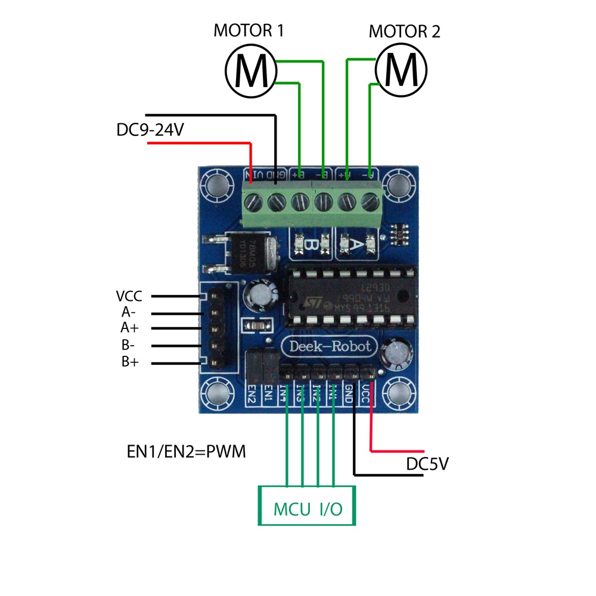

# Pi 
Raspberry Pi 4 Model B, 8GB Ram used for Project

Pinout: 

Pi -> Component

Ultrasound sensor:

    5V power (Pin 4) ->VCC
    GPIO 18 (Pin 12) -> Trig
    GPIO 8 (Pin 24) -> Echo
    Ground (Pin 14) -> Gnd
    
Servo:
    
    Ground (Pin 6) -> - 
    3.3V power (Pin 1) -> +
    GPIO 17 (Pin 11) -> logic
    
 

Motor Driver:
    
    5V (Pin 2) ->  VCC
    Ground (Pin 34) -> GND
    GPIO 24 (Pin 18) -> in1
    GPIO 23 (Pin 16) -> in2 
    GPIO 5 (Pin 29) -> in3
    GPIO 6 (Pin 31) -> in4
    GPIO 25 (Pin 22) -> en1
    GPIO 26 (Pin 37) -> en2
    
    